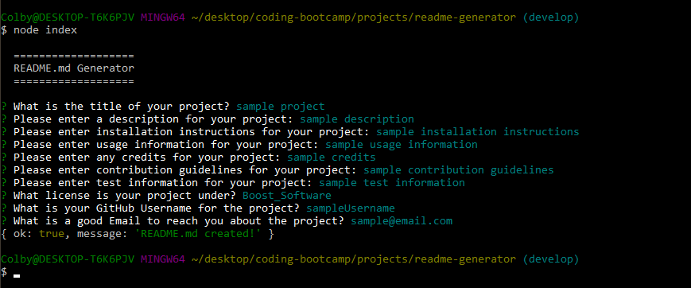
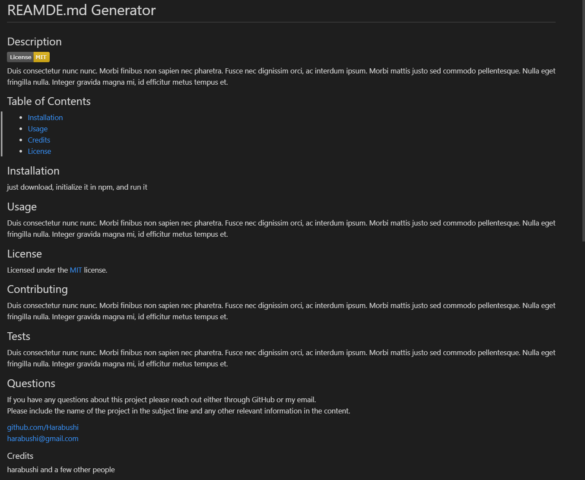

  # Auto-README

  ## Description
  
   
  This app will take user input about a project and automatically fill in a professional quality README.md, including a Table of Contents, badge display for License, and standard starting categories for information.

  ## Table of Contents

  - [Screenshots and Walkthrough](#walkthrough)
  - [Installation](#installation)
  - [Usage](#usage)
  - [Credits](#credits)
  - [License](#license)

  ## Screenshots and Walkthrough

  [Walk-Through Video](https://drive.google.com/file/d/1aARFr57dHNdkQDLXjCh6-PHBMsweGeJR/view?usp=sharing)
  
  

  

  ## Installation

  To install this project: Simply download it from GitHub and run npm init from the terminal on the installation folder.

  ## Usage

  To use this app, run "node index" in your preferred terminal, then follow along and answer the questions to your desired completeness. At the end a README.d will be populated in the "dist" folder ready for use.

  ## License

  
  Licensed under the [MIT](https://opensource.org/licenses/MIT) license.
   

  ## Contributing

  No current contribution guidelines in place.

  ## Tests

  No current test information available.

  ## Questions

  If you have any questions about this project please reach out either through GitHub or my email. 
  Please include the name of the project in the subject line and any other relevant information in the content. 

  [github.com/Harabushi](https://github.com/Harabushi) 
  [harabushi.creations@gmail.com](mailto:harabushi.creations@gmail.com)
  
  ### Credits

  This is a solo project, but I have been helped by the guidelines from the class, the Instructor and TA's, and fellow classmates.
